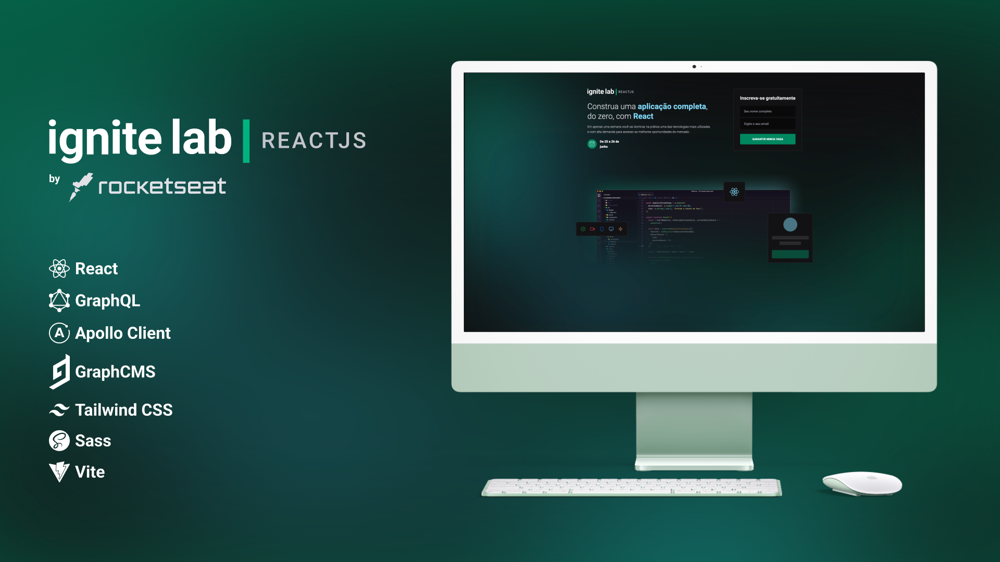

# Event Platform React com GraphQL
Projeto desenvolvido no Ignite Lab

## 🛠 Skills

![react][react] ![graphql][graphql] ![apollo client][apollo] ![tailwind css][tailwind] ![vite][vite]

## 🌐Preview do Projeto
https://event-platform-graphql-demo.vercel.app

 

[react]: https://img.shields.io/badge/react-1E4174?style=for-the-badge&logo=react&logoColor=white
[graphql]: https://img.shields.io/badge/graphql-1E4174?style=for-the-badge&logo=graphql&logoColor=white
[apollo]: https://img.shields.io/badge/apollo%20client-1E4174?style=for-the-badge&logo=apollographql&logoColor=white
[tailwind]: https://img.shields.io/badge/tailwind%20css-1E4174?style=for-the-badge&logo=tailwindcss&logoColor=white
[vite]: https://img.shields.io/badge/vite-1E4174?style=for-the-badge&logo=vite&logoColor=white
